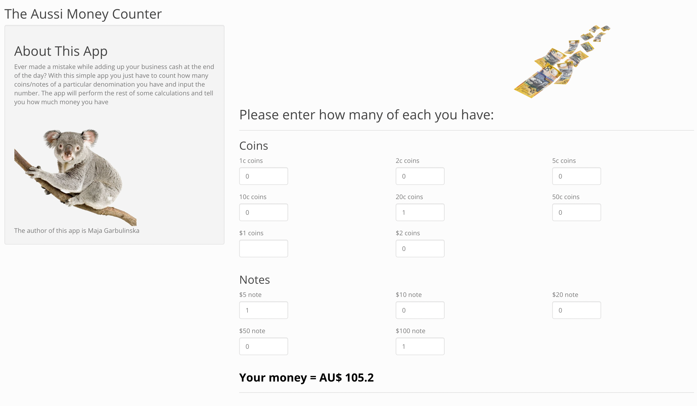

# The Aussi Money Counter - R Shiny
In this repository you will find a super simple money counting app. I used to work in a Hostel in Sydney, Australia. After every shift, I had to count the cash  money from guests. Back then, to make things simple, I created an excel spreadsheet. This app is an R Shiny Version of that spreadsheet. The following image should give you some intuition on how it works.

